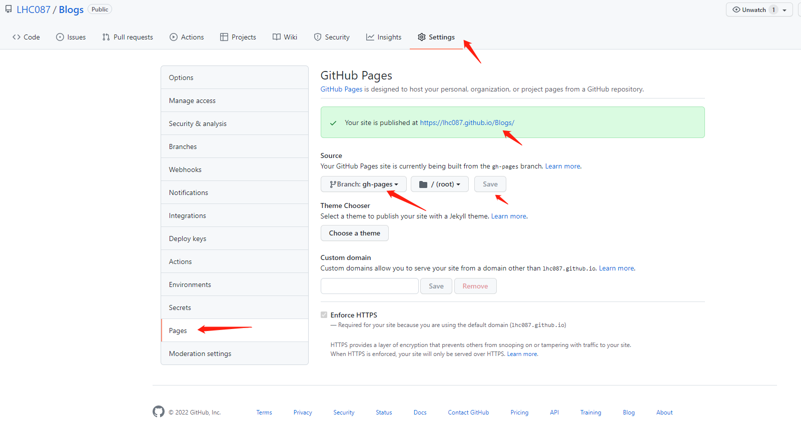

## 部署 GitHub Pages

1. 先将本地创建好的文件提交到 git 仓库（这里执行提交 git 的指令）

2. 在本地项目文件夹打开 Git Base Here (先安装 git)，执行部署命令，可以在远程仓库创建了 gh-pages 分支，并已打包好静态资源文件了

```
sh deploy.sh
```


远程的仓库代码现在如下：

gh-pages 分支：


main 主干：


3. 在仓库的 Settings -> Pages 中配置 GitHub Pages



设置成功后访问的地址就是这个了：[https://lhc087.github.io/Blogs/](https://lhc087.github.io/Blogs/)

至此，我们完成了 VuePress 和 Github Pages 的部署。

谢谢！！！
