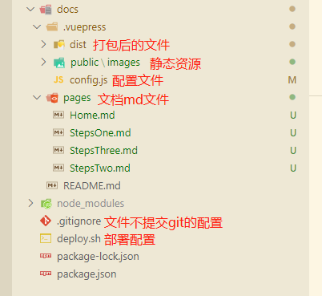

## 创建 VuePress 项目

#### 前提条件 VuePress 需要 Node.js >= 8.6

### 1. 本地搭建

1. 在本地电脑克隆新建仓库的 git 地址，初始化项目

```
git clone (git 地址）
```

2. 进入一个目录，并安装依赖

```
cd Blogs # npm install -D vuepress
```

3. 创建你的第一篇文档，VuePress 会以 docs 为文档根目录，所以这个 README.md 相当于主页：

```
mkdir docs && echo '# Hello VuePress' > docs/README.md
```

4. 在 package.json 中添加一些 scripts

```
{
  "scripts": {
    "docs:dev": "vuepress dev docs",
    "docs:build": "vuepress build docs"
  }
}
```

5. 在本地启动服务器

```
npm run docs:dev
```

6. VuePress 会在 http://localhost:8080 (opens new window) 启动一个热重载的开发服务器。

`success [09:15:51] Build 28e606 finished in 312 ms! ( http://localhost:8080/Blogs/ )`

### 2. 基础配置

1. 整个项目结构是这样的



2. 在文档目录下创建一个 .vuepress 目录，所有 VuePress 相关的文件都会被放在这里

创建 config.js 文件设置基本配置

```
module.exports = {
  title: "VuePress + Github Pages 搭建博客",   // 标题
  description: "VuePress + Github Pages 搭建博客", // 说明
  base: "/Blogs/",   // 路径名为 "/<REPO>/" 这里设置和git仓库名一致
  theme: "reco",    // 更换主题 需要安装 vuepress-theme-rec （npm install vuepress-theme-reco --save-dev）
  locales: {
    "/": {
      lang: "zh-CN",  // 设置语言
    },
  },
  themeConfig: {   // 导航栏结构
    subSidebar: "auto",  // 右侧开启目录结构
    nav: [
      { text: "首页", link: "/pages/Home" },
      {
        text: "LHC087",
        items: [
          {
            text: "Github",
            link: "https://github.com/LHC087",
            target: "_blank",
          },
          {
            text: "CSDN",
            link: "https://blog.csdn.net/weixin_43829905",
            target: "_blank",
          },
        ],
      },
    ],
    sidebar: [    // 侧边栏结构
      {
        title: "简介",
        path: "/pages/Home",
        collapsable: false, // 不折叠
        children: [{ title: "简介说明", path: "/pages/Home" }],
      },
      {
        title: "实现步骤",
        path: "/pages/StepsOne",
        collapsable: false, // 不折叠
        children: [
          { title: "创建GitHub仓库", path: "/pages/StepsOne" },
          { title: "创建 VuePress 项目", path: "/pages/StepsTwo" },
          { title: "部署 GitHub Pages", path: "/pages/StepsThree" },
        ],
      },
    ],
  },
};

```

3. 创建 pages 文件夹放置 md 文件（遵循 Markdown 的语法写文章）

pages 文件夹下面放置自己写的文章，访问的路径在 config.js 里面配置对应的侧边栏或者是导航栏即可访问

4. 创建.gitignore 文件，内容如下，可以提交代码时不提交 node_modules 模块到 git 仓库上（此步骤可跳过）

```
/node_modules
```

5. 创建一个脚本文件：deploy.sh 用于部署代码到 git 仓库，注意修改一下对应的用户名和仓库名

```
#!/usr/bin/env sh

# 确保脚本抛出遇到的错误
set -e

# 生成静态文件
npm run docs:build

# 进入生成的文件夹
cd docs/.vuepress/dist

git init
git add -A
git commit -m 'deploy'

# 如果发布到 https://<USERNAME>.github.io/<REPO>
git push -f https://github.com/LHC087/Blogs.git master:gh-pages   // 打包后的文件直接放在gh-pages分支，在设置GitHub Pages时直接访问这个分支即可访问到打包后的静态资源文件了
cd -
```
